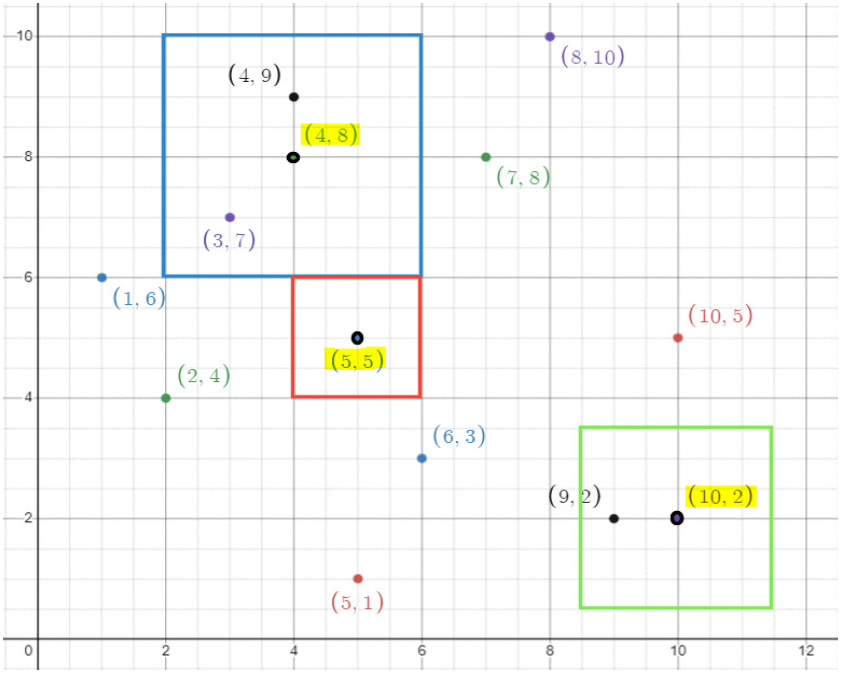

# 2D Range Search: High-Performance Spatial Query System

This project implements and compares two advanced data structures—the **Range Tree** and the **2D Segment Tree**—to solve the **Orthogonal Range Searching Problem**. [cite_start]This is a fundamental challenge in computational geometry, directly applied in real-world scenarios like **finding nearby points-of-interest (e.g., restaurants)** on a map[cite: 7].

[cite_start]The solution provides guaranteed, asymptotically optimal logarithmic time complexity for queries, making it robust for large-scale, production-level spatial datasets[cite: 12].

---

## Problem Statement & Core Objective

[cite_start]The task is to build a `PointDatabase` capable of efficiently answering "search nearby" queries, specifically those defined by the **Chebyshev distance** ($\ell_{\infty}$ distance)[cite: 14].

[cite_start]The $\ell_{\infty}$ distance between two points $p_1=(x_1, y_1)$ and $p_2=(x_2, y_2)$ is defined as $\max(|x_1-x_2|, |y_1-y_2|)$[cite: 14]. [cite_start]A query involves finding all points $p$ in a set $S$ such that $||p-q||_{\infty} \le d$, which translates into finding all points within an **axis-aligned square search box**: $[q_x - d, q_x + d] \times [q_y - d, q_y + d]$[cite: 14].

### Performance Requirements

| Operation | Time Complexity ($n$: points, $m$: results) |
| :--- | :--- |
| **Construction** | [cite_start]$O(n \log n)$ [cite: 20] |
| **Query** | [cite_start]$O(m + \log^2 n)$ [cite: 22] |

---

## Implementation Details (C++)

The project is implemented in C++ to leverage low-level performance and demonstrate robust data structure design.

* **Data Structures:** Full, custom implementation of the **Range Tree** (`RangeTree.h`) and **2D Segment Tree** (`SegmentTree2D.h`).
* [cite_start]**Preprocessing:** Both structures utilize a recursive merge-sort approach during construction to ensure the required $O(n \log n)$ preprocessing time[cite: 20].
* [cite_start]**Querying:** The core querying logic involves decomposing the 2D search box into $O(\log^2 n)$ canonical segments, followed by a binary search on the secondary structures (sorted-by-Y lists) to achieve the $O(m + \log^2 n)$ query time[cite: 22].

---

## Demonstration and Verification

[cite_start]The `main.cpp` driver tests both implemented structures against a standard set of points and queries, demonstrating correct functionality and adherence to performance specifications[cite: 35].

### Initial Dataset

The database is built from 10 integer-coordinate points:
[cite_start]$$ S = \{(1,6), (2,4), (3,7), (4,9), (5,1), (6,3), (7,8), (8,10), (9,2), (10,5)\} $$ [cite: 36]

### Test Cases and Output

The test cases run queries against the initial dataset:

| Query No. | Query Point ($\mathbf{q}$) | Distance ($\mathbf{d}$) | Bounding Box ($\mathbf{x} \times \mathbf{y}$) | Expected Output |
| :--- | :--- | :--- | :--- | :--- |
| 1 | $(5.0, 5.0)$ | $1.0$ | $[4, 6] \times [4, 6]$ | [cite_start]`[]` [cite: 38] |
| 2 | $(4.0, 8.0)$ | $2.0$ | $[2, 6] \times [6, 10]$ | [cite_start]`[(3,7), (4,9)]` [cite: 40] |
| 3 | $(10.0, 2.0)$ | $1.5$ | $[9, 11] \times [1, 3]$ | [cite_start]`[(9,2)]` [cite: 41] |

The search space is defined by the Chebyshev distance, where \( d \) defines the side length of the search square around the query point.

---

## Comparative Analysis

For a detailed analysis of the performance bounds and comparative superiority against alternatives like the K-d Tree, see [Optimization.md](Comparison/Optimization.md).
